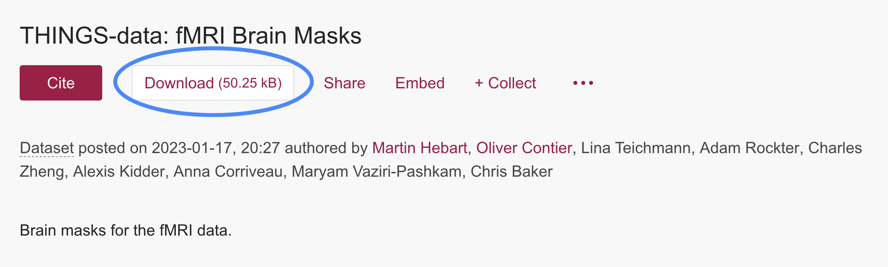

# THINGS-data

[THINGS-data](https://elifesciences.org/articles/82580) is a collection of large-scale datasets for the study of natural object representations in brain and behavior. It includes functional magnetic resonance imaging (fMRI) data, magnetoencephalographic (MEG) recordings, and 4.70 million similarity judgments in response to thousands of images from the [THINGS object concept and image database](https://doi.org/10.1371/journal.pone.0223792).

# Code Repositories

This repository the scripts and notebooks for reproducing the neuroimaging analyses presented in the [THINGS-data paper](https://elifesciences.org/articles/82580). It is structured into two sub-folders reflecting the two neuroimaging data modalities: 
- [MRI](MRI)
- [MEG](MEG)


# Download

## figshare

THINGS-data is hosted as a collection of data objects on figshare. 

> 🔗 THINGS-data on FigShare
> 
> [https://doi.org/10.25452/figshare.plus.c.6161151](https://doi.org/10.25452/figshare.plus.c.6161151)

Besides the raw data, this collection includes a data derivatives such as preprocessed versions of both the fMRI and MEG data. Additional derivatives for the fMRI data include single trial response estimates, cortical surface maps, noise ceiling estimates, and regions of interest.

You can browse the collection and download individual parts which are relevant for your research.

For smaller files, you can simply click the `Download` button!


If you plan to download larger data objects, it might make sense to start this process in the command line. Simply right-click on the `Download`` button and copy the link address. Executing the following code in the command line to begin the download process for that file. 
```
# This link downloads the fMRI single trial responses
wget -O betas_csv.zip https://plus.figshare.com/ndownloader/files/36789690
```
Since downloading larger data object may take some time, it can make sense to run this process in the background with tools such as `screen` or `tmux`.


## OpenNeuro

The raw fMRI and MEG datasets are available on [OpenNeuro](https://openneuro.org). 

> 🔗 THINGS-data on OpenNeuro
> 
> - MRI: [https://openneuro.org/datasets/ds004192](https://openneuro.org/datasets/ds004192)
> - MEG: [https://openneuro.org/datasets/ds004212](https://openneuro.org/datasets/ds004212)

The official [documentation](https://docs.openneuro.org/user-guide) gives helpful explanations on how to download data from OpenNeuro.


## OSF

The behavioral dataset containing 4.7 million human similarity judgements is available on OSF and can be downloaded directly via your web browser.

> 🔗 THINGS-data on OSF
> 
> [osf.io/f5rn6/](https://osf.io/f5rn6/)


# How to cite
```
@article {
	THINGSdata,
	article_type = {journal},
	title = {THINGS-data, a multimodal collection of large-scale datasets for investigating object representations in human brain and behavior},
	author = {Hebart, Martin N and Contier, Oliver and Teichmann, Lina and Rockter, Adam H and Zheng, Charles Y and Kidder, Alexis and Corriveau, Anna and Vaziri-Pashkam, Maryam and Baker, Chris I},
	editor = {Barense, Morgan},
	volume = 12,
	year = 2023,
	month = {feb},
	pub_date = {2023-02-27},
	pages = {e82580},
	citation = {eLife 2023;12:e82580},
	doi = {10.7554/eLife.82580},
	url = {https://doi.org/10.7554/eLife.82580},
	journal = {eLife},
	issn = {2050-084X},
	publisher = {eLife Sciences Publications, Ltd},
}
```